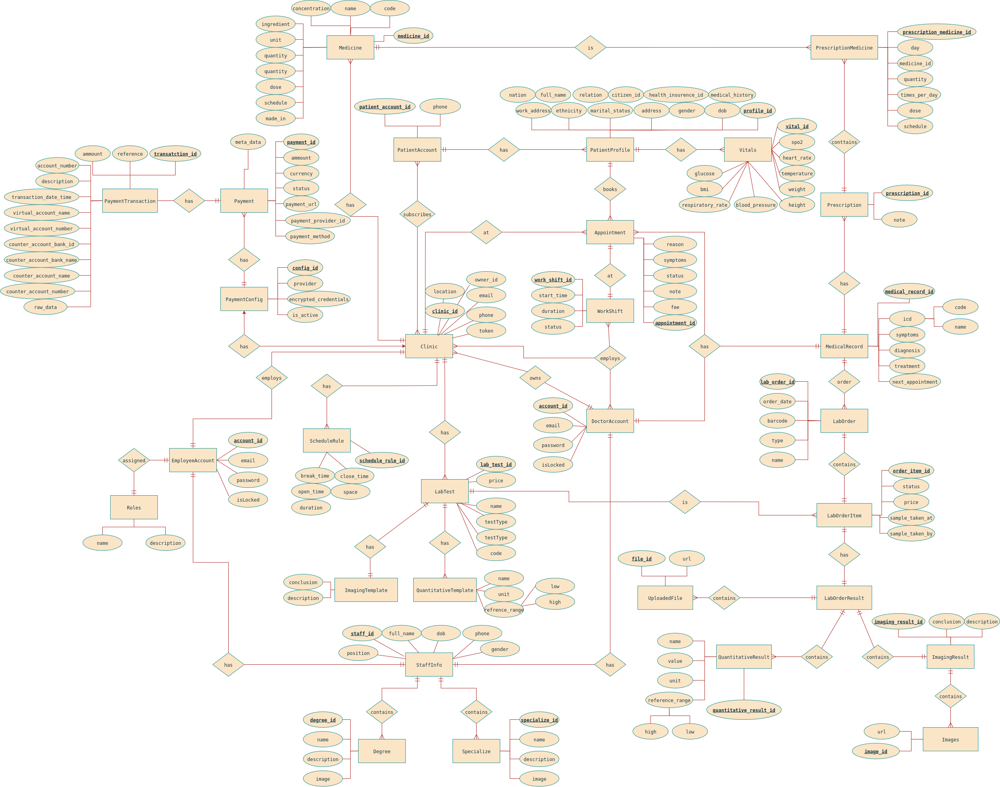
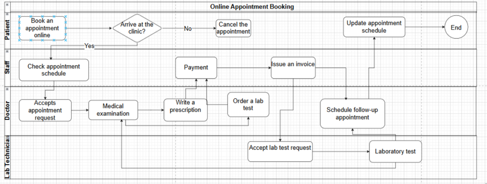
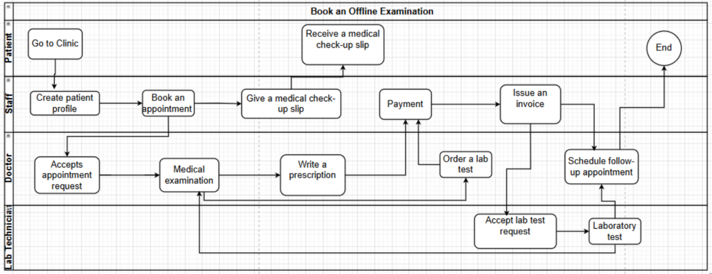
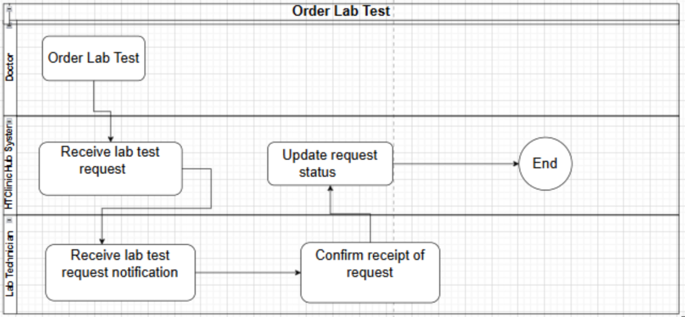

# Description
This is the back-end for HTclinchub, a multi-clinic management system designed to help healthcare providers track patients, manage check-ins, and view medical results in a secure and efficient way. This app ensure that clinics share the same robust back-end services while keeping their operations and patient data separate
- Front-end gits: [Doctor front-end](https://github.com/nambh130/htclinichub), [Patient front-end](https://github.com/ItsVuong/htclinic-patient-front-end)

# Main Features
- Patient check-in and appointment tracking
- Manage EHRs
- Lab test result and imaging result management
- Role-based access control for doctors, staff, and admins

# Document
## Entity Relationship Diagram
- 
## Main Workflow
- 
- 
- 

# Run project
1. Create a `.env` file in the root folder by copying `.env.example` and filling in the missing fields.
2. Make sure you have **Docker** and **Docker Compose** installed.
3. Run the project with:
```bash
docker compose up --build
```
